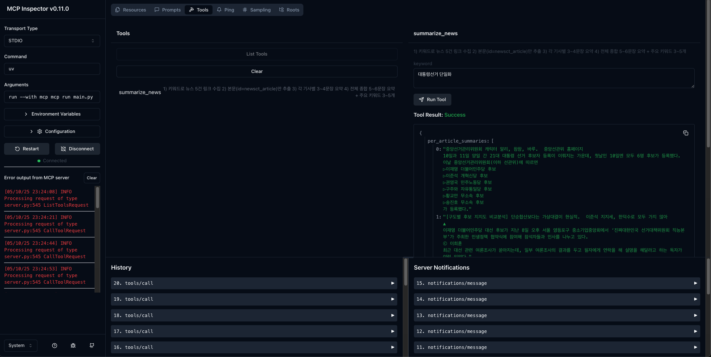

# 🧪 MCP 기반 뉴스 요약 툴 실행 가이드
이 저장소는 뉴스테크 워크샵에서 진행된 오장민 교수님의 실습을 통해 알게된 사실을 기반으로 작성하였습니다.

## ✅ uv 설치
```bash
# GitHub 가이드 참고 (https://github.com/astral-sh/uv)
# macOS / Linux 환경
curl -LsSf https://astral.sh/uv/install.sh | sh
```

## ✅ uv 프로젝트 설정 및 가상환경 실행
```bash
# Python 3.12 기준 가상환경 생성
uv venv --python 3.12

# 가상환경 활성화
source .venv/bin/activate
```

## ✅ 의존성 패키지 설치
```bash
uv add "mcp[cli]" requests beautifulsoup4 ipykernel python-dotenv
```

## ✅ 네이버 개발자 애플리케이션 등록
- [네이버 오픈API 앱 등록](https://developers.naver.com/apps/#/register) 페이지에서 임의의 앱 생성
- 생성 후 `Client ID`, `Client Secret` 확인 및 저장

## ✅ main.py 생성
- 참고 문서
  - [MCP 전체 스펙](https://modelcontextprotocol.io/llms-full.txt)
  - [공식 Python SDK README](https://github.com/modelcontextprotocol/python-sdk/blob/main/README.md)

- 구현 요구사항
  - **Tool**: 사용자가 키워드를 입력하면, NAVER 뉴스 검색 API로 관련 뉴스 5건 수집 → 각 뉴스에서 `id="newsct_article"` 기준으로 본문 추출
  - **Prompt**: 메타정보(제목/출처/날짜 등)는 제외하고,
    - 각 기사별 요약 (3~4줄)
    - 전체 요약 (5~6줄)
    - 주요 키워드 3~5개 추출

📁 위 기능을 구현한 `main.py` 파일을 프로젝트 루트에 포함하세요.

## ✅ 실행
```bash
# MCP Inspector 개발 모드로 실행
mcp dev main.py
```

- 최초 실행 시 MCP Inspector가 자동 설치됩니다.
- 예시 출력:
  ```
  🔍 MCP Inspector is up and running at http://127.0.0.1:6274 🚀
  ```

웹 브라우저에서 해당 주소 접속 후:
1. 좌측 상단 **Connect** 클릭  
2. 상단 **Tools** → **List Tools** 클릭  
3. `summarize_news` 선택 후, 우측 입력창에 키워드 입력 → **Run Tool**

## ✅ 실행 예시 결과



- 키워드: `"대통령선거 후보"`
- 결과는 최신 뉴스에 따라 달라질 수 있습니다.
